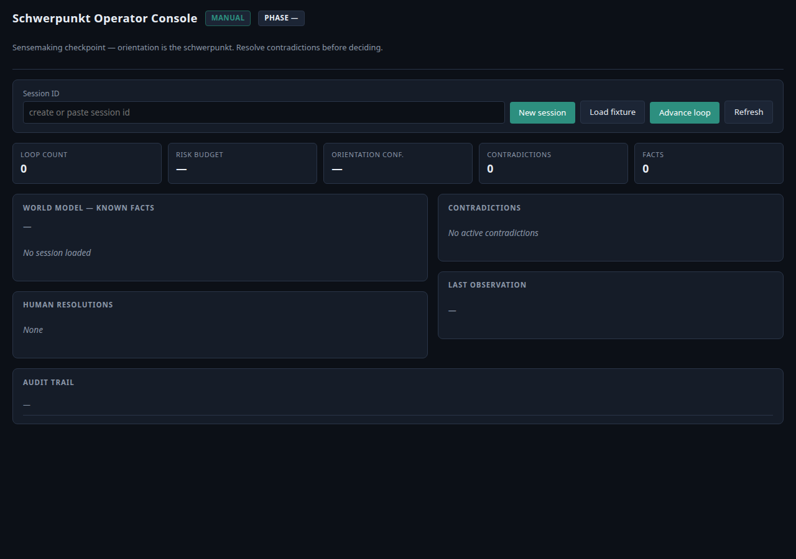
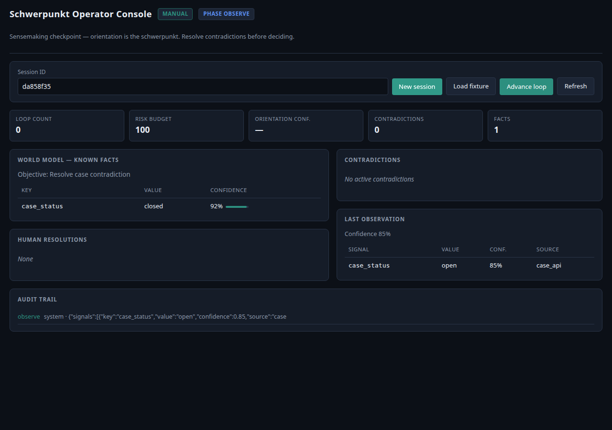
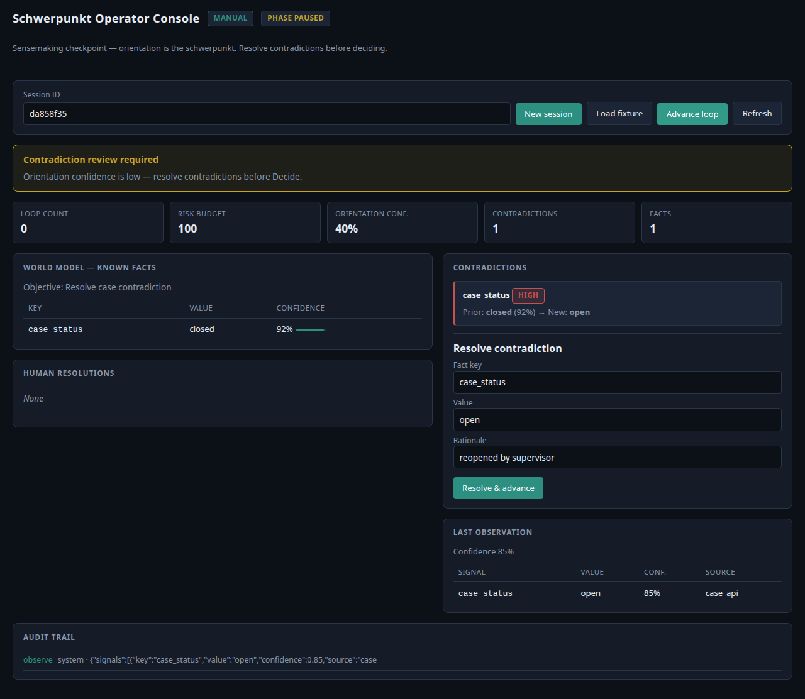
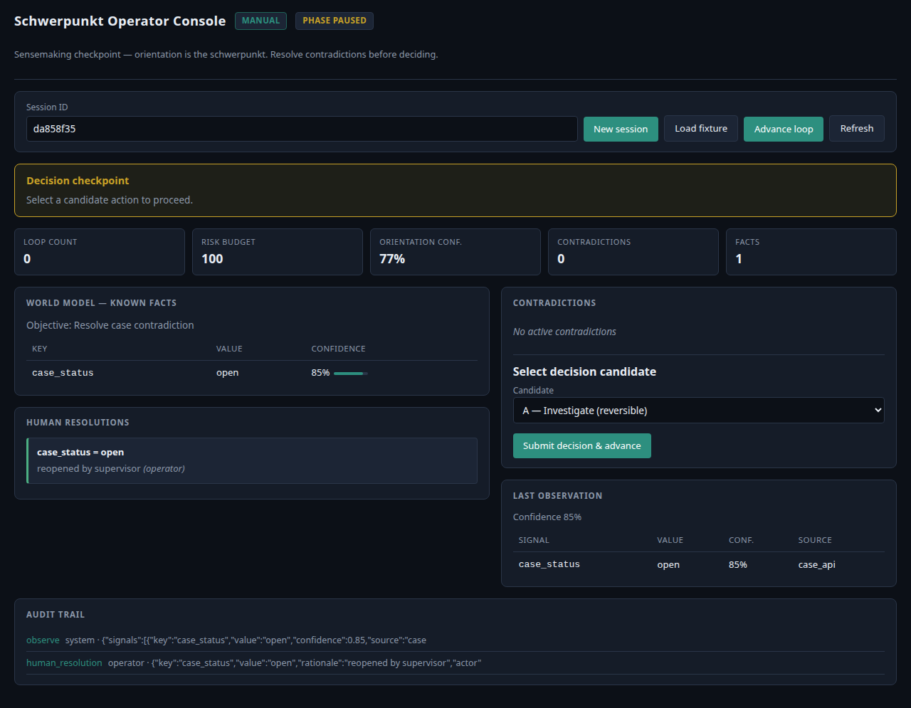
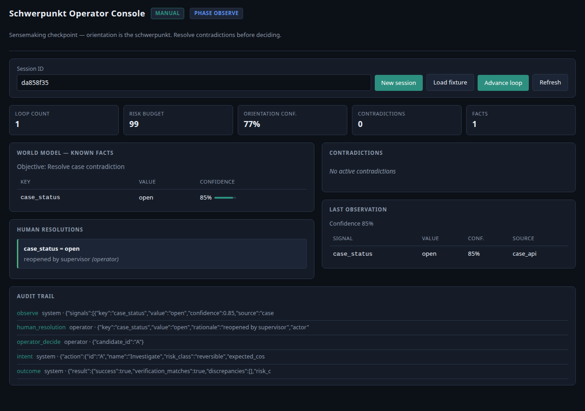

# Operator Demo Walkthrough

Headless or browser demo of Boyd OODA **manual mode** — operators perform Orient and Decide; no LLM or MCP required.

Screenshots in this doc were captured from a live `manual` session against the operator console at `/console`.

## Prerequisites

```bash
cd schwerpunkt
python -m venv .venv && source .venv/bin/activate
pip install -e ".[dev]"
```

## Option A: CLI (unattended / CI-friendly)

```bash
make demo
# or: ./scripts/demo-manual.sh
```

Example output:

```
==> Starting contradiction_case manual demo
Session: a74f3cf8
{"phase": "observe", "confidence": 0.85}
{"phase": "paused", "pending": "orient"}
==> Resolving contradiction (operator step)
{"phase": "decide"}
{"phase": "paused", "pending": "decide"}
{"phase": "decide"}
{"phase": "observe", "pending": null}
==> Demo complete for session a74f3cf8 (loop_count=1)
```

Steps performed:

1. Create manual session with `contradiction_case` fixture
2. Load observe signals (closed case in world model, open signal from API)
3. Advance → **pause at Orient** (contradiction)
4. Operator resolves `case_status` → `open`
5. Advance → **pause at Decide** (pick candidate)
6. Operator selects candidate A (Investigate)
7. Act executes; audit trail records intent/outcome

---

## Option B: Browser console (visual walkthrough)

```bash
export SCHWERKPUNKT_MODE=manual
export SCHWERKPUNKT_PROFILE=local
uvicorn schwerpunkt.api.app:app --reload
```

Open http://127.0.0.1:8000/console

### Step 1 — Empty console

The operator lands on the console with session controls, metrics strip, and empty world-model panels.



**What you see:**
- Mode badge (`manual`) and phase indicator
- Toolbar: session ID, New session, Load fixture, Advance loop
- Metrics: loop count, risk budget, orientation confidence, contradiction/fact counts

### Step 2 — Session loaded with observe fixture

Click **New session** — creates `contradiction_case` and loads the observe fixture.



**What you see:**
- World model fact: `case_status = closed` (92% confidence) from prior knowledge
- Last observation: `case_status = open` (85% confidence) from `case_api`
- Contradiction not yet surfaced until the loop advances

### Step 3 — Contradiction checkpoint (Orient pause)

Click **Advance loop** — orientation detects the conflict and pauses for human sensemaking.



**What you see:**
- Yellow banner: *Contradiction review required*
- Contradictions panel: `case_status` HIGH — Prior `closed` → New `open`
- Orientation confidence drops to ~40%
- **Resolve contradiction** form pre-filled with `open` / `reopened by supervisor`

This is the **schwerpunkt** moment: orientation shapes whether the agent can proceed to Decide.

### Step 4 — After operator resolution

Click **Resolve & advance** — human resolution merges into the world model.



**What you see:**
- Contradictions cleared
- Human resolutions panel records operator override
- World model updated: `case_status = open`
- Loop advances toward Decide

### Step 5 — Decide checkpoint

Click **Advance loop** again — runtime pauses for operator candidate selection.


**What you see:**
- Banner: *Decision checkpoint*
- Candidate dropdown: A (Investigate), B (Close case, irreversible), C (Defer)
- IG&C is **disabled** in manual mode by default — operator must Decide

### Step 6 — After Act

Click **Submit decision & advance** — system executes the chosen action.



**What you see:**
- Loop count increments to 1
- Risk budget consumed
- Audit trail: `observe` → `human_resolution` → `operator_decide` → `intent` → `outcome`
- Phase returns to `observe` for the next cycle

---

## Regenerating screenshots

With the API running on port 8000:

```bash
SCHWERKPUNKT_MODE=manual uvicorn schwerpunkt.api.app:app --port 8000 &
.venv/bin/python scripts/capture-console-screenshots.py
```

Outputs land in `docs/screenshots/`.

---

## Option C: Stub mode (automated verification)

```bash
make test
make spec
```

---

## Fixtures

| Scenario | File | Operator action |
|----------|------|-----------------|
| Contradiction | `fixtures/scenarios/contradiction_case.json` | Resolve `case_status` |
| IG&C fast path | `fixtures/scenarios/igc_retrieve.json` | None (auto bypass in stub) |
| Risk budget | Create session with `risk_budget=0` | Observe escalation |

## Grok concept mapping

| Boyd phase | Demo behavior |
|------------|---------------|
| Observe | Fixture sensors inject signals |
| Orient | Operator resolves contradictions (schwerpunkt) |
| Decide | Operator picks candidate / approves irreversible |
| Act | System executes + audit intent/outcome |
| IG&C | Rule table bypass in stub; disabled in manual by default |
