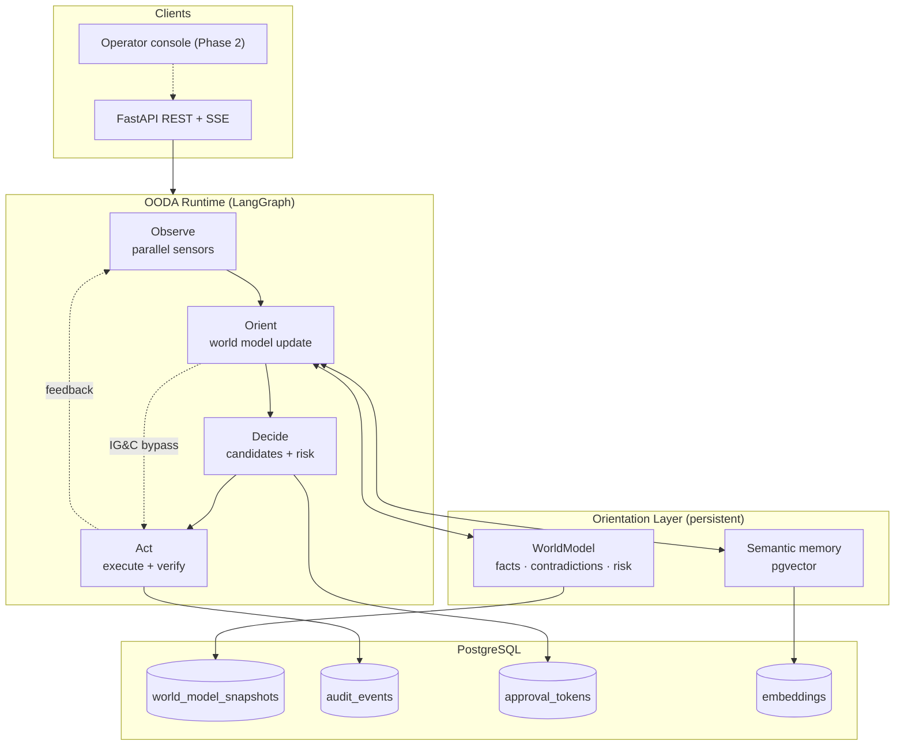
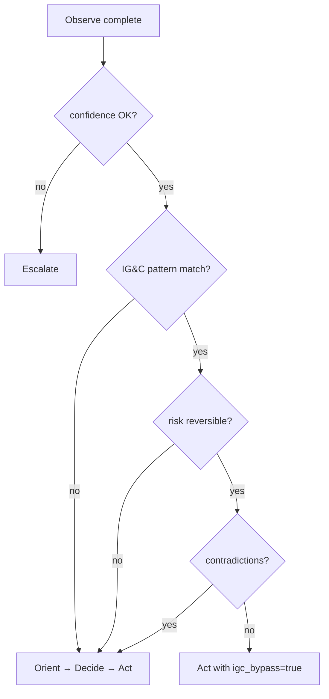
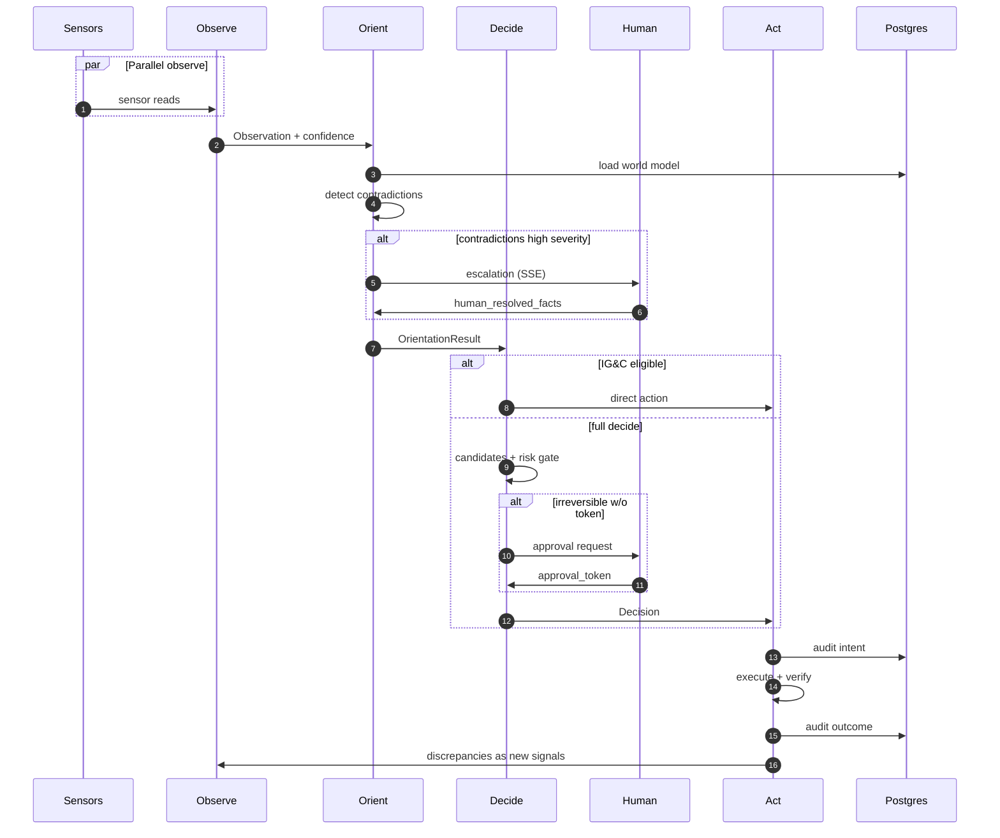

# Schwerpunkt — System Architecture

Conceptual architecture for the OODA agent platform. Implementation follows OpenSpec living specs and the technology choices in [TECHNOLOGY-SELECTION.md](TECHNOLOGY-SELECTION.md).

## High-level diagram



## OODA phase responsibilities

| Phase | Module (planned) | Inputs | Outputs |
|-------|------------------|--------|---------|
| **Observe** | `observe/sensors.py` | Agent context, sensor registry | `Observation` (signals, failed_sensors, confidence) |
| **Orient** | `orient/world_model.py` | Observation, prior WorldModel | `OrientationResult` (updated model, contradictions, confidence) |
| **Decide** | `decide/planner.py` | OrientationResult | `Decision` (action, alternatives, escalate?) |
| **Act** | `act/executor.py` | Decision | `ActionResult` (outcome, verification, discrepancies) |

## Domain objects

### Observation

```python
# Conceptual — not implemented yet
Observation(
    signals: list[Signal],           # valid readings
    failed_sensors: list[str],
    timestamp: datetime,
    confidence: float,               # gates Orient/Decide
)
```

### WorldModel (schwerpunkt)

```python
WorldModel(
    task_objective: str,
    completed_steps: list[Step],
    pending_hypotheses: list[Hypothesis],
    known_facts: dict[str, FactWithConfidence],
    contradictions: list[Contradiction],
    irreversible_actions_taken: list[Action],
    active_constraints: list[Constraint],
    risk_budget_remaining: float,
    loop_count: int,
    elapsed_ms: int,
    deadline: datetime | None,
)
```

### Decision

```python
Decision(
    action: CandidateAction | None,
    escalate: Escalation | None,     # mutually exclusive with action
    alternatives_considered: list[CandidateAction],
    confidence: float,
    igc_bypass: bool,
)
```

### Audit event types

| Type | When | Purpose |
|------|------|---------|
| `intent` | Before Act | What agent planned |
| `outcome` | After Act | What actually happened |
| `escalation` | Decide/Orient gate | Why human needed |
| `human_resolution` | After checkpoint | Human orientation input |
| `igc_bypass` | Observe→Act skip | Fast path audit |
| `risk_budget_reset` | Admin action | Governance |

## IG&C (fast path) decision flow



## Data flow — one loop iteration



## Cross-cutting concerns

| Concern | Approach |
|---------|----------|
| Checkpointing | LangGraph checkpointer → Postgres |
| Correlation | `session_id` on all audit events |
| Confidence | Computed per phase; propagated multiplicatively |
| Compression | Orient summarizes low-confidence facts when over token budget |
| Testing | Unit tests without LLM; BDD from OpenSpec |

## Package layout (Phase 1 target)

```
schwerpunkt/
  openspec/              # Living specs
  docs/                  # Concept, architecture, tech selection
  src/
    schwerpunkt/
      runtime/           # LangGraph graph definition
      observe/
      orient/
      decide/
      act/
      api/               # FastAPI routes + SSE
      store/             # Postgres repositories
  tests/
    unit/
    features/            # Gherkin / pytest-bdd
  .beads/                # Issue tracking
```

## Related documents

- [CONCEPT.md](CONCEPT.md) — Boyd OODA synthesis
- [TECHNOLOGY-SELECTION.md](TECHNOLOGY-SELECTION.md) — stack trade-offs
- [../openspec/specs/README.md](../openspec/specs/README.md) — behavior contracts
